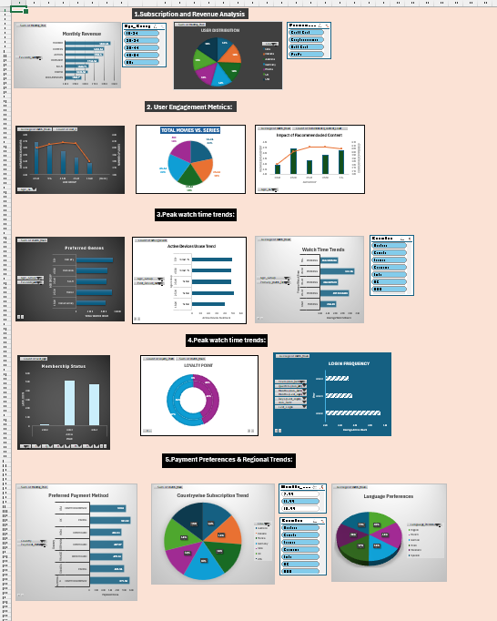

# Streaming Service User Analytics & Retention Dashboard 📊

## 📌 Project Overview
This project focuses on transforming raw, unorganized operational user logs from a streaming service into a high-fidelity, interactive analytical tool. Using **Advanced Microsoft Excel** as the core engine, the project covers the entire data lifecycle: data extraction via Power Query, structural schema cleaning, deep logical modeling, and executive dashboard design. 

The primary business objective is to identify user behavioral patterns, segment consumer personas, isolate systemic data anomalies, and provide clear visibility into retention and churn pipelines.

---

## 🛠️ Tech Stack & Excel Tooling
*   **Data Ingestion & ETL:** Power Query (Data cleaning, type casting, text splitting, and column merging).
*   **Analytical Formulas:** Advanced logical and lookup chains (`XLOOKUP`, `INDEX-MATCH`, `IFERROR`, `NESTED IFs`, `DATEDIF`).
*   **Aggregation Engine:** Pivot Tables & Pivot Charts with Custom Conditional Formatting.
*   **User Interface:** Interactive Slicers, Timelines, and Dynamic KPI Cards.

---

## 📈 Dashboard Architecture & Insights

> 💡 *Insert a stellar screenshot of your final Excel Dashboard below to catch a recruiter's eye instantly!*



### Key Analytical Pillars Built:
1. **User Retention Tracker:** Tracks active vs. churned subscriber pipelines across different tier brackets.
2. **Data Anomaly Isolation:** Automated validation logic built with nested formulas to systematically catch missing values, duplicate entries, and inconsistent registration timestamps.
3. **Cohort Behavioral Breakdown:** Segmented user activity based on geographical regions and payment profiles to identify high-value customer lifetime value (CLV) patterns.

---

## 📂 Repository Structure
```text
├── datasets/
│   └── raw_user_logs.csv             # Mock dataset representing raw user sign-ups and interactions
├── dashboards/
│   └── Streaming_Analytics_Tool.xlsx # Final, fully interactive Excel workbook with dashboards
├── images/
│   └── dashboard_preview.png         # High-resolution screenshot of the analytical layout
└── README.md                         # Project documentation and write-up
